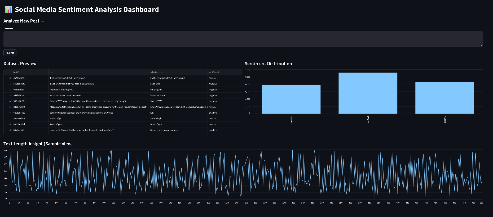
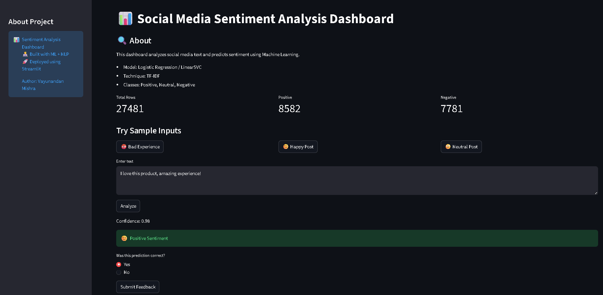
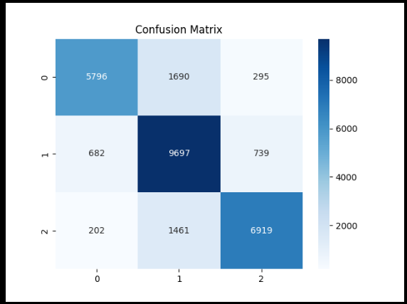
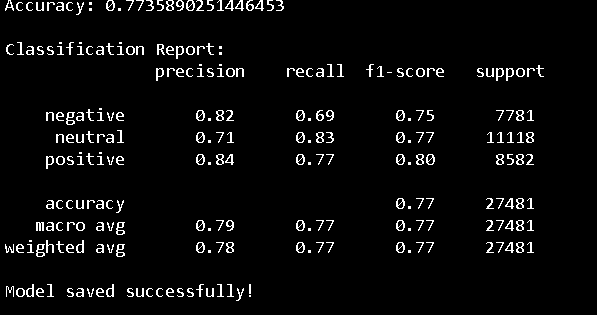

# 📊 Social Media Sentiment Analysis Dashboard

## 🔗 Live Demo

👉 https://social-media-sentiment-dashboard-buvzjwxu5ez4wrpad8fd62.streamlit.app/

## 💻 GitHub Repository

👉 https://github.com/Vayu-143/social-media-sentiment-dashboard

---

## 🚀 Overview

This project is an **end-to-end Social Media Sentiment Analysis Dashboard** that uses **Natural Language Processing (NLP)** and **Machine Learning** to classify text into:

* 😊 Positive
* 😐 Neutral
* 😡 Negative

It also provides an **interactive Streamlit dashboard** for real-time predictions, analytics, and visualization.

Sentiment analysis helps organizations understand public opinion from massive social media data, which is otherwise difficult to analyze manually ([Hex][1]).

---

## 🎯 Problem Statement

Social media generates huge volumes of unstructured text data.
Manually analyzing this data is inefficient and error-prone.

👉 This project solves that by building an **automated ML pipeline + dashboard** to:

* Analyze sentiment instantly
* Visualize trends
* Enable real-time decision-making

---

## 🛠 Tech Stack

**Language:** Python
**Libraries:** Pandas, NumPy, Scikit-learn, NLTK
**NLP Technique:** TF-IDF Vectorization
**Model:** Logistic Regression / LinearSVC
**Visualization:** Matplotlib, Seaborn, WordCloud
**Frontend:** Streamlit

---

## ⚙️ Features

### 🔍 Core ML Features

* ✅ Text preprocessing (cleaning, stopwords removal)
* ✅ Sentiment classification (positive, neutral, negative)
* ✅ Model confidence score
* ✅ Confusion matrix evaluation

### 📊 Dashboard Features

* ✅ Real-time sentiment prediction
* ✅ Interactive dataset preview & filtering
* ✅ Sentiment distribution charts
* ✅ WordCloud visualization (per sentiment)
* ✅ Top words frequency analysis
* ✅ Pie chart visualization

### 🧠 Smart Features

* ✅ Feedback collection system (user validation)
* ✅ Prediction logging (CSV storage)
* ✅ Sample demo inputs for quick testing

---

## 📂 Project Structure

```
Social-Media-Sentiment-Analysis-Dashboard/
│
├── data/
│   └── dataset.csv
│
├── src/
│   ├── preprocess.py
│   ├── train.py
│   └── predict.py
│
├── models/
│   ├── model.pkl
│   └── vectorizer.pkl
│
├── app/
│   └── app.py
│
├── outputs/
│   ├── confusion_matrix.png
│   ├── predictions.csv
│   └── feedback.csv
│
├── images/
│   ├── dashboard.png
│   ├── prediction.png
│   ├── confusion_matrix.png
│   └── model_results.png
│
├── requirements.txt
├── README.md
└── main.py
```

---

## ▶️ How to Run Locally

### 1️⃣ Install Dependencies

```
pip install -r requirements.txt
```

### 2️⃣ Train the Model

```
python src/train.py
```

### 3️⃣ Run the Dashboard

```
streamlit run app/app.py
```

---

## 📊 Results

* ✔ Accuracy: ~77% – 82%
* ✔ Balanced performance across all sentiment classes
* ✔ Tested on real-world Twitter dataset

---

## 📸 Screenshots

### 🔹 Dashboard



### 🔹 Prediction



### 🔹 Confusion Matrix



### 🔹 Model Results



---

## 📌 Learning Outcomes

* NLP preprocessing techniques (tokenization, stopwords, cleaning)
* Feature extraction using TF-IDF
* Machine Learning model training & evaluation
* Building interactive dashboards with Streamlit
* Handling real-world noisy datasets

---

## 💼 Resume Description

Built an end-to-end NLP pipeline to classify social media text into positive, negative, and neutral sentiment. Applied TF-IDF vectorization and Logistic Regression/LinearSVC, and developed an interactive Streamlit dashboard with real-time predictions, feedback system, and data visualization. Achieved ~80% accuracy on real-world dataset.

---

## 🔮 Future Improvements

* 🚀 Deploy using Docker / FastAPI
* 🤖 Upgrade to Deep Learning (LSTM / BERT)
* 📊 Add advanced analytics (trend detection)
* ☁️ Integrate real-time APIs (Twitter, Reddit)

---

## 👨‍💻 Author

**Vayunandan Mishra**

---

## ⭐ Support

If you found this project useful, consider ⭐ starring the repository!

---

[1]: https://hex.tech/templates/sentiment-analysis/social-media-sentiment-analysis/?utm_source=chatgpt.com "Social Media Sentiment Analysis (with examples) - Hex"
